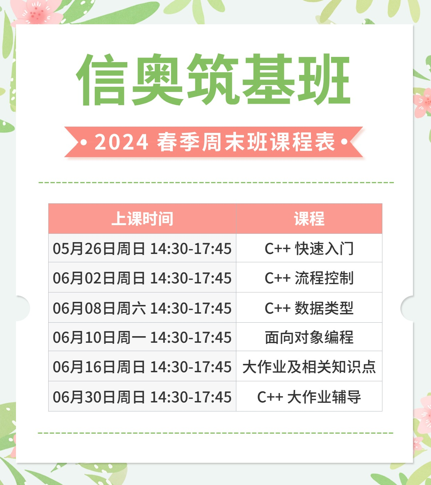

# 魏永明的学生编程课之信奥筑基班

首先感谢各位家长和同学的支持！本文件包含了魏永明的学生编程课之信奥筑基班直播课程的课前准备工作、演示视频获取方法、课程表、课件入口以及课后服务的介绍。请务必仔细阅读。

## 课前准备

同普及班内容；获赠普及班课程的同学，请转[这里](ClassNewbie.md)。

## 课程资料

### 演示视频内容

为保证良好的视频播放效果，我们使用抖音平台分发本课程涉及的演示视频内容。请在报名后添加班主任的企业微信，并告知孩子的抖音号，同时申请关注用于分发视频课的抖音私密账号：

- 抖音号：57262203445
- 昵称：魏永明的编程课之筑基班

在班主任确认了孩子的抖音账号之后，即可观看上述私密账号中的演示视频内容。

### 课件入口

信奥筑基班的课件入口：

1. [C++ 快速入门](https://courses.fmsoft.cn/plzs/cpp-quick-start.html)
1. [C++ 流程控制](https://courses.fmsoft.cn/plzs/cpp-flow-control.html)
1. [C++ 数据类型](https://courses.fmsoft.cn/plzs/cpp-data-types.html)
1. [C++ 面向对象编程](https://courses.fmsoft.cn/plzs/cpp-class-and-oop.html)
1. [C++ 大作业及相关知识点](https://courses.fmsoft.cn/plzs/cpp-project.html)
1. [C++ 大作业辅导](https://courses.fmsoft.cn/plzs/cpp-project-coaching.html)

### 建议学习方法

1. 观看直播课程或回放时，务必横屏观看，使用平板观看的效果更好。
1. 补充演示视频的观看：
    1. 在电脑上用浏览器登录[抖音官网](https://www.douyin.com)或者安装抖音电脑版应用，用已关注“魏永明的编程课之筑基班”的账号登录，即可通过该账号主页观看相应的课程内容。
    1. 观看直播（回放）做实操练习或者作业时，可在电脑上用浏览器打开对应的课件页面。此时若点击课件页面中演示视频的链接，就会跳转到抖音页面播放对应的视频（需要使用已关注“魏永明的编程课之筑基班”的账号登录抖音，否则无法观看）。此时，可在电脑上对照演示视频进行相应的实操练习。
1. 务必通过在 GitHub 或者 Gitee 上创建的代码仓库提交作业，老师会通过开源平台对作业进行点评。

特别提示：

1. 在课件页面中点击视频链接时，可按住 Shift 键或者 Windows 键/Command 键在新窗口或者新标签页页中播放视频。
1. 在浏览器中播放抖音视频时，默认声音是关闭的，请操作页面上的音量按钮打开声音。
1. 使用抖音电脑版应用可以获得更好的播放体验；此时可转到“魏永明的编程课之信奥筑基班”主页中根据视频的封面和标题选择播放对应的视频。
1. 抖音上发布的视频支持弹幕或者评论。欢迎同学们挑错并通过弹幕或者评论发表自己的看法，亦可提出问题。

## 课程表

### 周末组

### 暑期组

## 课后服务

报名后，班主任老师会将家长加入到信奥筑基班的班级微信群中。请家长修改群昵称为“某某某家长”，并请家长将孩子拉入班级群中。学生可直接添加主讲老师的微信账号，遇到问题可在群内提问，亦可单独找主讲老师解答。为了让同学们能够更好地理解课程内容，我们特别提供如下课后服务：

1. 每周五、周六或周日晚 20:00 到 21:30 三个时段安排作业点评和答疑直播，每周至少保证两次。
2. 如果需要，在京的同学可以利用非课程直播时段，来线下场地和老师交流。不在北京的同学，如果需要类似的服务，可以通过视频通话等方式提供。注意此项服务另行收费。需要的同学可以找班主任预约。

以上课后服务如果临时有变，会提前通知大家。

## 直播平台及相关链接

作业点评和答疑直播通过微信视频号进行，请扫码关注视频号“考鼎学堂”：

班主任的企业微信：

视频内容分发账号：

---

[面向十岁及以上学生的编程实战系列课程首页](README.md)
