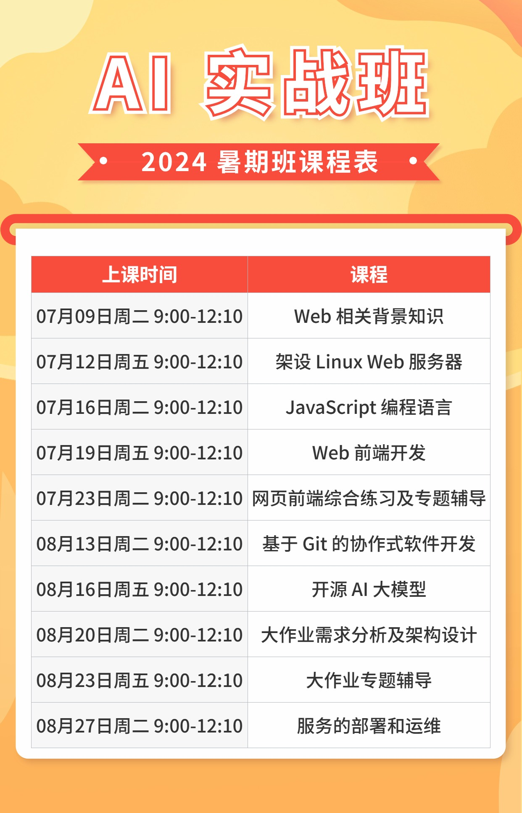

# 魏永明的学生编程课之AI实战班

首先感谢各位家长和同学的支持！本文件包含了AI实战班线上直播课程的课前准备工作、课件入口以及课后服务的介绍。请务必仔细阅读。

## 课前准备

### 学习用电脑

由于要运行 AI 大模型，需要配置较高的电脑，建议以小组为单位租用云主机服务器。

如果要在自己的电脑上运行大模型，则需要直接安装 Ubuntu Linux，不能在虚拟机中运行，对应的硬件配置要求如下：

1. 支持 Ubuntu Linux 22.04 的台式机或笔记本；请参考如下页面获取认证的设备清单：<https://ubuntu.com/certified>。
1. 主频在 2GHz 以上的 8 核或以上处理器。
1. 内存 32GB 或以上。

其他要求同普及班内容；获赠普及班课程的同学，请转[这里](ClassNewbie.md)。

## 课程资料

### 课件入口

AI实战班的课件入口：

1. [Web 相关背景知识](https://courses.fmsoft.cn/plzs/fullstack-basic-of-web.html)
1. [架设 Linux 服务器](https://courses.fmsoft.cn/plzs/fullstack-setting-up-linux-server.html)
1. [JavaScript 编程语言](https://courses.fmsoft.cn/plzs/fullstack-javascript-language.html)
1. [Web 前端开发](https://courses.fmsoft.cn/plzs/fullstack-web-programming.html)
1. [网页前端综合练习及专题辅导](https://courses.fmsoft.cn/plzs/fullstack-web-programming-exercise.html)
1. [基于 Git 的协作式软件开发](https://courses.fmsoft.cn/plzs/fullstack-collaborative-development-based-on-github.html)
1. [开源 AI 大模型](https://courses.fmsoft.cn/plzs/fullstack-open-source-ai-llm.html)
1. [大作业需求分析及架构设计](https://courses.fmsoft.cn/plzs/fullstack-project-design.html)
1. [大作业专题辅导](https://courses.fmsoft.cn/plzs/fullstack-project-coaching.html)
1. [服务的部署和运维](https://courses.fmsoft.cn/plzs/fullstack-deploying-and-operations.html)

### 建议学习方法

1. 观看直播课程或回放时，务必横屏观看，使用平板观看的效果更好。
1. 观看直播（回放）做实操练习或者作业时，可在电脑上用浏览器打开对应的课件页面，此时，可在电脑上对照演示视频进行相应的实操练习。
1. 务必通过在 GitHub 或者 Gitee 上创建的代码仓库提交作业，老师会通过开源平台对作业进行点评。

## 课程表

### 暑期集训营

### 秋季学期周末组

（待定）

## 课后服务

报名后，班主任老师会将家长加入到 AI 实战班的班级微信群中。请家长修改群昵称为“某某某家长”，并请家长将孩子拉入班级群中。学生可直接添加主讲老师的微信账号，遇到问题可在群内提问，亦可单独找主讲老师解答。为了让同学们能够更好地理解课程内容，我们特别提供如下课后服务：

1. 每周五、周六或周日晚 20:00 到 21:30 三个时段安排作业点评和答疑直播，每周至少保证两次。
2. 如果需要，在京的同学可以利用非课程直播时段，来线下场地和老师交流。不在北京的同学，如果需要类似的服务，可以通过视频通话等方式提供。注意此项服务另行收费。需要的同学可以找班主任预约。

以上课后服务如果临时有变，会提前通知大家。

## 直播平台及相关链接

作业点评和答疑直播通过微信视频号进行，请扫码关注视频号“考鼎学堂”：

班主任的企业微信：

---

[面向十岁及以上学生的编程实战系列课程首页](README.md)
