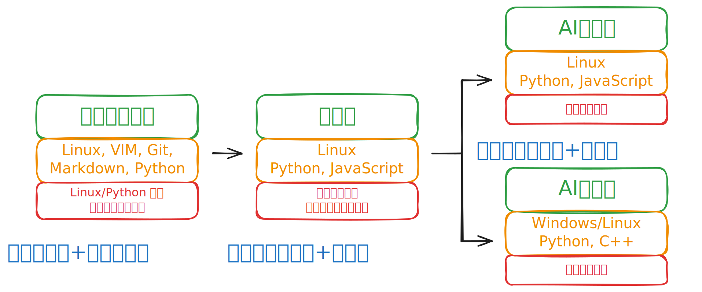

# 给零基础学生的编程课

本仓库包含由[魏永明](https://github.com/VincentWei)主讲的针对十岁及以上零基础学生的编程实战系列课程所用课件、示例程序等。

Programming Lessons for Zero-based Students Aged 10 to 18, by [Vincent Wei](https://github.com/VincentWei).

[TOC]

## 概述

本课程特点：

1. 面向零基础但对编程有强烈兴趣的大中小学生（年龄在 10 到 18 周岁；小学五年级到大学一年级），学过一些编程课程的更好。
1. 整个系列课程的内容和国际前沿接轨，会涉及到 Linux、Git、Python、JavaScript、开源 AI 大模型等开发环境或编程语言；下分四个课程：
   - 零基础普及班：针对零基础学生的课程，内容包括虚拟机的安装、Linux 桌面系统的安装和使用、常用 Linux 命令、VIM 编辑器、Git 使用、SHELL 编程及 Python 编程入门。
   - 筑基班：针对已入门学生开设，课程内容涉及 Python 和 JavaScript 编程语言，最终实现一个单机游戏的两个版本：终端版本和网页版本。
   - AI实战班：针对已掌握 Python 和 JavaScript 编程的学生开设。课程内容涉及开源 AI 模型以及网页编程，五人一组协作开发一个联网的网页游戏。
   - AI信奥班：针对已掌握 Python 和 JavaScript 编程的学生开设。课程内容涉及开源 AI 模型以及 C++ 编程语言，课程内容围绕一个联网的桌面游戏进行。
1. 授课方式：
   - 零基础普及版为录播课，外加答疑直播。
   - 筑牢基础班、AI实战班以及AI信奥班均为直播课，外加作业点评及答疑直播。
   - 作业点评和答疑直播每周至少安排两场，学生可连麦提问。
1. 学习周期：
   - 零基础普及班：两到三周。
   - 筑基班：周末班两个月；暑期班一个月。
   - AI实战班：周末班两个月；暑期班一个月。
   - AI信奥班：周末班两个月；暑期班一个月。

对学生的要求：

1. 小学五年级及以上。
1. 学有余力且对编程有强烈的兴趣。
1. 做好“听课一小时，实践八小时”的投入准备。

家长不用担心自己不懂软件或者编程而无法辅导孩子，只要做好如下几件事情即可：

1. 准备好一台专用于学习和开发的台式电脑或笔记本电脑给孩子使用。
1. 协助年龄较小的孩子在 Gitee 或者 GitHub 平台上注册开发者账号。

## 主讲介绍

魏永明，青海湟中人，清华大学精仪系机械制造专业毕业，研究生学历，工学硕士学位，飞漫软件创始人，2013 年度“开源软件杰出贡献人物”，2023 年度世界开源贡献榜人物。1999 年发布了知名开源软件 MiniGUI 并持续研发至今。二十多年来，该软件广泛应用于各类硬件产品。其主要编（译）著有《MiniGUI 剖析》、《Linux 实用教程》、《Linux 设备驱动程序》（二、三版）、《C 语言最佳实践》等。2018 年 11 月，发起合璧操作系统开源协作项目；2020 年 8 月，提出世界首款可编程标记语言 HVML；2022 年 7 月，开源发布 HVML 解释器及渲染器。2022 年底，HVML 项目获评 CSDN 2022 “年度开源影响力项目”；2023 年，HVML 项目入选国际测试委员会年度世界开源 Top100 榜。

## 课程计划

本课程和一般聚焦于某个特定编程语言的课程不同，课程中会涉及很多开发环境、工具和编程语言。课程的目的不是培养熟悉特定编程语言的专家，而是能够熟练利用已有的资源，包括各种开发工具、软件包、开源软件等来完成特定开发任务的小小软件工程师。

课程分三个阶段。

入门阶段（零基础普及版），生在 Linux 上开发程序为目标；期间会涉及 Linux/Unix 命令行、代码编辑器VIM、SHELL 程序、代码仓库管理工具（git）、Python

阶段通过一个从简单逐步变复杂的单机游戏，来引导学生了解各种常用的开发工具和编程语言的特点，掌握各种不同的开发环境和编程语言的共性。期间会涉及 Linux/Unix 命令行、代码编辑器VIM、SHELL 程序、代码仓库管理工具（git）、Python、HTML/CSS/JavaScript、HVML 等。对应的教学目标是，学生面对任何一种常见编程语言编写的程序代码，都能大致读懂其工作流程，借助互联网资源和开源世界中的各种已有软件包和代码，能够实现自己需要的增强功能，最终破除学生对程序、编程语言的神秘感，并激发其好奇心。

基础阶段包含 10 场直播课和相应的视频内容。学生主要使用 Python、JavaScript 来完成两个单机游戏，前者用于字符界面，后者用于图形界面，故而基础阶段的课程内容主要围绕这两个编程语言进行。

提高阶段将分组完成一项大作业。分组的策略是混合编队，就是不同年龄段的学生编到一个组当中，有基础或者大年龄段的学生担任组长，助教扮演项目主管角色。小组通过自建的代码仓库完成分工协作。大作业的任务可以由小组讨论确定（需要经过教学团队确认，以免目标太大无法完成），也可以选择教学团队给定的任务。大作业必须是联网的、包含人工智能元素的多人参与的小型游戏。

提高阶段的教学将围绕大作业所需要的技术和软件安排，包含 10 场直播课以及相应的视频内容，同时会安排一些面向对象编程语言（Python、JavaScript、C++）的知识，以开拓学生的眼界。

该课程的设计以“授人以渔”为目标，通过在教学中模拟当下和未来几年的软件开发模式，讲述软件工程师日常使用的工具和需要掌握的知识，以大作业为依托，引导学生制定需求、实现需求，通过自身的努力实践，将零基础的学生培养成面向未来的小小软件工程师。

## 直播平台及报名

课程的直播通过微信视频号进行，可扫码关注视频号“魏永明的编程课”：

报名可联系视频号客服或者直接添加企业微信工作人员：

## 准备阶段

### 学习用电脑

学习用电脑最好是专用的，以防误操作导致数据丢失。电脑可以是：

1. 支持 Ubuntu Linux 22.04 的台式机或笔记本；请参考如下页面获取认证的设备清单：<https://ubuntu.com/certified>。
1. 2020 年以后生产的运行 macOS 14+ 的苹果 Mac 台式机或者笔记本。
1. 2020 年以后生产的运行 Windows 10/11 的台式机或者笔记本。

电脑的硬件配置要求：

- 主频在 2GHz 以上的 4 核或以上处理器；若安装虚拟机，则应选择 8 核或以上处理器。
- 内存 16GB 或以上；若安装虚拟机，则选择 32GB 或以上处理器。

考虑到基础阶段对电脑配置的要求不高，故如果已经有电脑则可暂时不用购置新的电脑。在进入提高阶段学习时，需要运行开源的人工智能大模型，此时再行考虑购置新的开发用电脑。

### 注册 GitHub 账号

家长需协助孩子在 <https://github.com> 或者 <https://gitee.com> 上注册一个开发者账号。在 GitHub 上注册需要一个电子邮件地址，在 Gitee 上注册需要一个中国大陆地区的手机号码。课程相关的学习资料、文档、示例程序等，通过如下代码仓库发布：

- GitHub: <https://github.com/VincentWei/PLZS>，或
- Gitee: <https://gitee.com/vincentwei7/PLZS>

在注册后，请确保在开发用电脑上使用 Chrome、Edge 浏览器登录 GitHub，并让孩子牢记账号名称和账号密码。

## 课程资料

各讲课件的幻灯片版本入口：

- 零基础普及班：
   1. [准备开发环境](https://courses.fmsoft.cn/plzs/preparing-ubuntu-linux.html)
   1. [学用 Linux 桌面系统](https://courses.fmsoft.cn/plzs/using-linux-desktop.html)
   1. [我的第一个 Shell 程序](https://courses.fmsoft.cn/plzs/my-first-shell-program.html)
   1. [我的第一个 Python 程序](https://courses.fmsoft.cn/plzs/my-first-python-program.html)
   1. [我的第一个开源仓库](https://courses.fmsoft.cn/plzs/my-first-open-source-repository.html)
- 筑基班：
   1. [流程控制（Python）](https://courses.fmsoft.cn/plzs/python-flow-control.html)
   1. [数据类型（Python）](https://courses.fmsoft.cn/plzs/python-data-types.html)
   1. （静候）
- AI 实战班：
   1. （静候）
- AI 信奥班：
   1. （静候）

## 版权声明及许可证

本仓库中的文档及示例程序遵循 AGPL 3.0 许可证发布；由北京飞漫软件技术有限公司持有其著作权。

PLZS - Programming Lesson for Zero-based Students Aged 10 ~ 18
Copyright (C) 2024  Beijing FMSoft Technologies Co., Ltd.

This program is free software: you can redistribute it and/or modify
it under the terms of the GNU Affero General Public License as published
by the Free Software Foundation, either version 3 of the License, or
(at your option) any later version.

This program is distributed in the hope that it will be useful,
but WITHOUT ANY WARRANTY; without even the implied warranty of
MERCHANTABILITY or FITNESS FOR A PARTICULAR PURPOSE.  See the
GNU Affero General Public License for more details.

You should have received a copy of the GNU Affero General Public License
along with this program.  If not, see <http://www.gnu.org/licenses/>.

